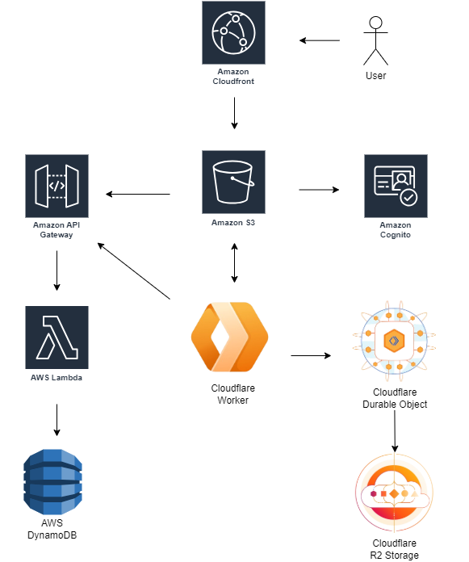

# Whiteboard App

A collaborative whiteboard application built on the powerful [tldraw](https://tldraw.dev/) framework. This app enables users to create accounts, generate unique interactive whiteboards, and share them with others through secure permalink access - no login required for viewers.

## Table of Contents

- [Getting Started](#getting-started)
- [Frontend](#frontend)
- [Backend Architecture](#backend-architecture)
- [Deployment Guide](#deployment-guide)
- [Environment Configuration](#environment-configuration)
- [Contributing](#contributing)

## Getting Started

1. **Clone the repository**
   ```bash
   git clone <repository-url>
   cd whiteboard-app
   ```

2. **Set up the frontend**
   ```bash
   cd frontend
   npm install
   npm start
   ```

3. **Configure your environment** (see [Environment Configuration](#environment-configuration))

4. **Deploy the backend** (see [Deployment Guide](#deployment-guide))

## Frontend

The React frontend provides a user-friendly interface for creating and managing whiteboards, user accounts, and collaborative drawing sessions. Built with React 18, AWS Cognito for authentication, and Tldraw.

For detailed setup instructions, features, and architecture, see [`frontend/README.md`](./frontend/README.md).

## Backend Architecture

This project implements a modern serverless architecture combining AWS and Cloudflare services.

### System Components

#### **Lambda Functions** (`/lambdas`)
- **User Management**
- **Board Operations**
- **Token System**
- **Data Storage**

📚 **Documentation**: [`lambdas/README.md`](./lambdas/README.md)

#### **WebSocket Worker** (`/websocket/worker`)
- **Live Collaboration**
- **Asset Management**
- **Room State**


📚 **Documentation**: [`websocket/worker/README.md`](./websocket/worker/README.md)

## Environment Configuration

Configure these environment variables across all services for proper integration:

#### **Frontend Environment** (`.env.local`)
```bash
# AWS Cognito Configuration
REACT_APP_COGNITO_CLIENT_ID="your-cognito-client-id"
REACT_APP_COGNITO_USER_POOL_ID="your-user-pool-id"

# API Endpoints
REACT_APP_API_URL="https://your-api-gateway-url"
REACT_APP_TLDRAW_WORKER_URL="https://your-cloudflare-worker-url"

# Application URLs
REACT_APP_HOST_URL="https://your-domain.com"
```

#### **Cloudflare Worker** (`wrangler.toml`)
```toml
[vars]
API_URL = "https://your-api-gateway-url/doesboardexist"

[[r2_buckets]]
binding = "ASSETS"
bucket_name = "whiteboard-assets"
```

#### **Lambda Environment Variables**
Configure in AWS Console or deployment scripts:
```bash
# DynamoDB table names
USERS_TABLE="users"
BOARDS_TABLE="boards"

# Other AWS service configurations
AWS_REGION="eu-central-1"
```

---

## Deployment Guide

This project uses a serverless architecture designed for cheap, on-demand workflow.

### Architecture Overview



### AWS Services

#### **Frontend Hosting**
- **Amazon S3**: Static website hosting
- **CloudFront**: Global CDN with HTTPS

#### **Backend API**
- **API Gateway**: HTTP endpoints
- **Lambda Functions**: Serverless compute
- **DynamoDB**: NoSQL database with the following tables:
  - `users`: User profiles and board associations
  - `boards`: Board metadata, tokens, and access control

#### **Authentication**
- **Amazon Cognito**: User accounts management

### Cloudflare Services

#### **Real-time Features**
- **Cloudflare Workers**: WebSocket handling
- **Durable Objects**: Managing boards states
- **R2 Storage**: Storage for assets

---

## Step-by-Step Deployment

#### 1️⃣ **AWS Infrastructure Setup**

**Deploy Lambda Functions:**
```bash
# Package and deploy Lambda functions
cd lambdas
zip -r lambda-functions.zip .
# Upload via AWS Console or use SAM/CDK for automated deployment
```

**Create Database Tables:**
```bash
# Create Users table
aws dynamodb create-table \
  --table-name users \
  --attribute-definitions AttributeName=userId,AttributeType=S \
  --key-schema AttributeName=userId,KeyType=HASH \
  --billing-mode PAY_PER_REQUEST

# Create Boards table
aws dynamodb create-table \
  --table-name boards \
  --attribute-definitions AttributeName=boardId,AttributeType=S \
  --key-schema AttributeName=boardId,KeyType=HASH \
  --billing-mode PAY_PER_REQUEST
```

You can also do it manually using AWS website.

**Configure API Gateway:**
- Create HTTP API
- Set up Lambda proxy integrations
- Deploy to production stage

**Set up Cognito:**
- Create User Pool
- Configure App Client for frontend integration
- Set up Amplify authentication

#### 2️⃣ **Cloudflare Workers Setup**

If you configured your credentials you can execute folowing commands:

```bash
cd websocket
npm install

npx wrangler deploy

npx wrangler r2 bucket create whiteboard-assets
```

#### 3️⃣ **Frontend Deployment**

```bash
cd frontend
npm install
npm run build

# Deploy to S3
aws s3 sync build/ s3://your-whiteboard-bucket

# Create CloudFront distribution
aws cloudfront create-distribution \
  --distribution-config file://cloudfront-config.json
```

As well as previously, those steps could be done manually on AWS website.

---

## 📄 License

This project is licensed under the MIT License - see the LICENSE file for details.
---
